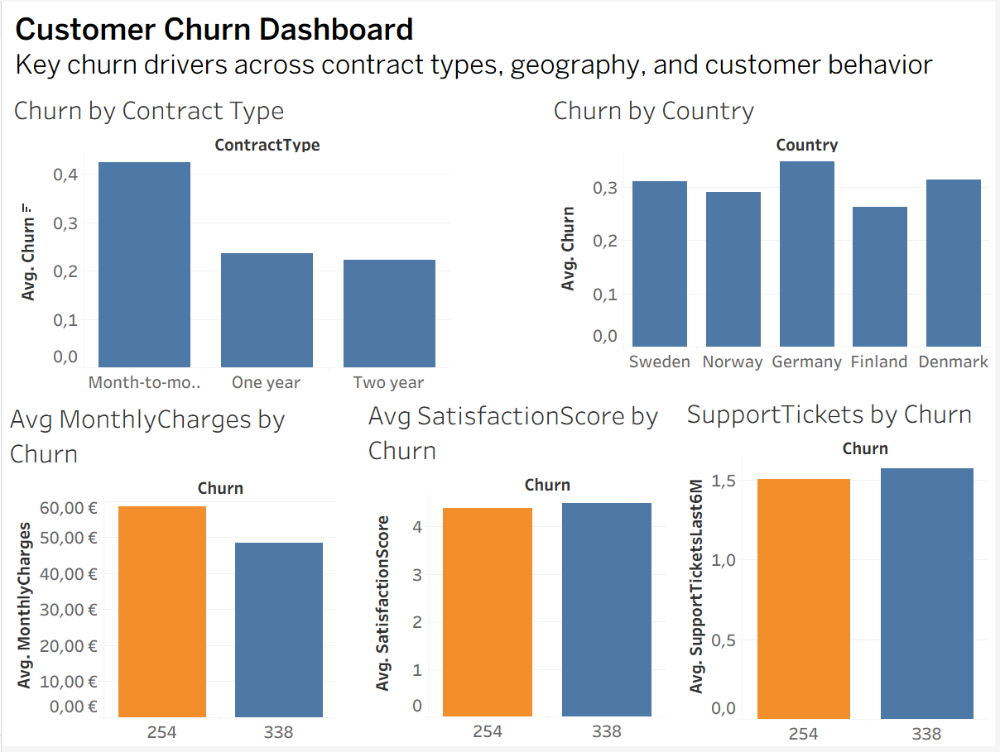

# Customer Churn Analysis (Python · Excel · Tableau)

# Executive Summary
This project analyzes customer churn in a simulated telecom environment using a full analytics workflow across Python, Excel, and Tableau. The goal is to identify the key factors that drive churn and provide actionable business recommendations. The analysis shows that contract type, pricing, satisfaction score, and regional differences are the strongest predictors of churn. The final Tableau dashboard summarizes these insights in a clear, business‑friendly format.

# Meta Description
End‑to‑end customer churn analysis project using Python, Excel, and Tableau. Includes synthetic dataset generation, EDA, pivot tables, interactive dashboard, and business recommendations.

# Project Structure
customer-churn-analysis/
│
├── data/                     # Raw dataset (CSV)
├── excel/                    # Pivot tables and Excel analysis
├── images/                   # Dashboard images for README
├── notebooks/                # Jupyter notebooks (EDA, modeling)
├── src/                      # Python scripts (dataset generation)
├── README.md                 # Project documentation
└── requirements.txt          # Dependencies

# Project Overview
This project answers a central business question:
Which factors most strongly influence customer churn in a telecom company?
To explore this, the project includes synthetic dataset generation with realistic business logic, exploratory data analysis in Python, Excel pivot analysis for business‑friendly summaries, a Tableau dashboard for interactive insights, and final conclusions and recommendations.

# Workflow
1. Dataset Creation (Python)
- Generated a synthetic telecom churn dataset (2,000 customers)
- Included realistic features such as contract type, tenure, charges, support tickets, satisfaction score, and churn reason
- Ensured business realism, for example higher churn for month‑to‑month contracts

[Notebook:](notebooks/01_dataset_generation.ipynb)
[Script: ](src/generate_dataset.py)

2. Exploratory Data Analysis (Python)
- Data validation and cleaning
- Distribution analysis (age, charges, tenure)
- Correlation inspection
- Early churn pattern detection
[Notebook:](notebooks/02_eda.ipynb)

3. Excel Analysis
- Pivot tables for business‑friendly summaries
- Churn segmented by contract type, country, monthly charges, satisfaction score, and support tickets
[File](excel/Customer_Churn_Analysis.xlsx)

4. Tableau Dashboard
Interactive dashboard summarizing key churn drivers:
- Churn by contract type
- Churn by country
- Monthly charges vs churn
- Satisfaction score vs churn
- Support tickets vs churn

Tableau Public:
https://public.tableau.com/app/profile/aleksanteri.lohja/viz/Customer_Churn_Dashboard_17724439898590/CustomerChurnDashboard?publish=yes

# Key Insights
- Month‑to‑month customers churn the most, confirming that contract flexibility increases churn risk.
- Germany and Denmark show the highest churn, suggesting regional differences in satisfaction or competition.
- Churned customers pay more on average, indicating pricing sensitivity.
- Satisfaction score is a strong predictor of churn; lower scores correlate with higher churn.
- Support tickets do not reduce churn; customers with many tickets still churn, implying unresolved issues.

# Business Recommendations
The analysis highlights several actionable opportunities to reduce churn and improve customer retention.
- Introduce incentives for long‑term contracts. Month‑to‑month customers churn at the highest rate. Discounts, loyalty perks, or bundled services can encourage upgrades to longer contracts.
- Review pricing strategy for high‑charge customers. Churned customers pay more on average. A tiered pricing model, personalized discounts, or usage‑based billing could reduce price‑driven churn.
- Improve customer support quality. High support ticket volume does not correlate with lower churn, suggesting unresolved issues. Faster resolution times, proactive outreach, and improved self‑service tools could increase satisfaction.
- Target low‑satisfaction customers with retention campaigns. Satisfaction score is one of the strongest churn predictors. Early‑warning alerts and personalized retention offers can reduce churn in this segment.
- Investigate regional differences. Germany and Denmark show significantly higher churn. Localized customer research, competitive analysis, and region‑specific retention strategies may be needed.

# Tools and Technologies
- Python (pandas, numpy, matplotlib, seaborn)
- Excel (Pivot Tables, Power Query)
- Tableau Public
- Jupyter Notebook
- Visual Studio Code

# What I Learned
- How to design and generate a realistic synthetic dataset
- How to structure a full analytics workflow end‑to‑end
- How to combine Python, Excel, and Tableau effectively
- How to communicate insights visually and clearly
- How to build a clean, professional GitHub project structure

# About the Author
I am an Information Technology Engineering student specializing in Business Intelligence, data analytics, and modern data workflows. My strengths include Power BI, SQL, Python, Excel, and Tableau, and I focus on building clear, business‑oriented analytics solutions. I enjoy creating end‑to‑end portfolio projects that simulate real analyst work and demonstrate practical problem‑solving. I am based in Turku, Finland, and I am actively seeking hybrid or remote data analyst and BI roles.
